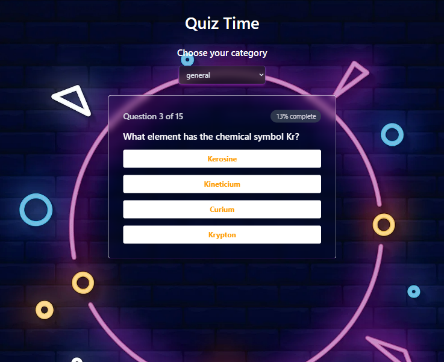

# SparkleQuiz

## Initial Plan:
1. Backend Core (Express & Database);

2. Frontend Setup (React & Vite & Tailwind);

3. Frontend/Backend Integration.

### DataBase Schema:
1. Question:
- id: ObjectId;
- question: String;
- answers: Array of Strings;
- correct_answer: String;

2. User:
- id: ObjectId;
- name: String;
- email: String;
- passwordHash: String;
- role: String ('user', 'admin');
- highScore: Number of Correct Answers.

### Routes:
1. /api/users/signup;
2. /api/users/login;
3. /api/quizes;

### Developing...:

