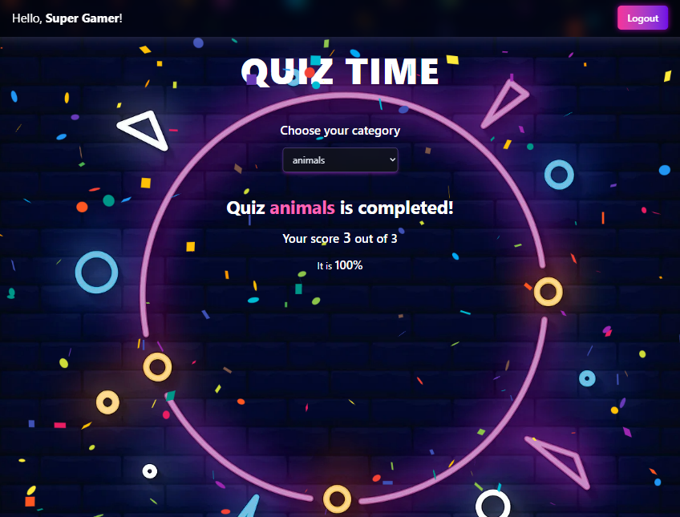

# SparkleQuiz

## Initial Plan:
1. Backend Core (Express & Database);

2. Frontend Setup (React & Vite & Tailwind);

3. Frontend/Backend Integration.

### DataBase Schema:
1. Question:
- id: ObjectId;
- question: String;
- answers: Array of Strings;
- correct_answer: String;

2. User:
- id: ObjectId;
- name: String;
- email: String;
- passwordHash: String;
- role: String ('user', 'admin');
- highScore: Number of Correct Answers.

### Routes:
1. /api/users;
2. /api/login;
3. /api/quizes;

### Developing...:
- Registration Form:

- Quiz Crard:

- Congratulations:

### Next step:
- ~~login / logout the user~~
- save (rewrite?) the score in DB (add save btn to UserScore)
- total dashboard for top users
- *admin part